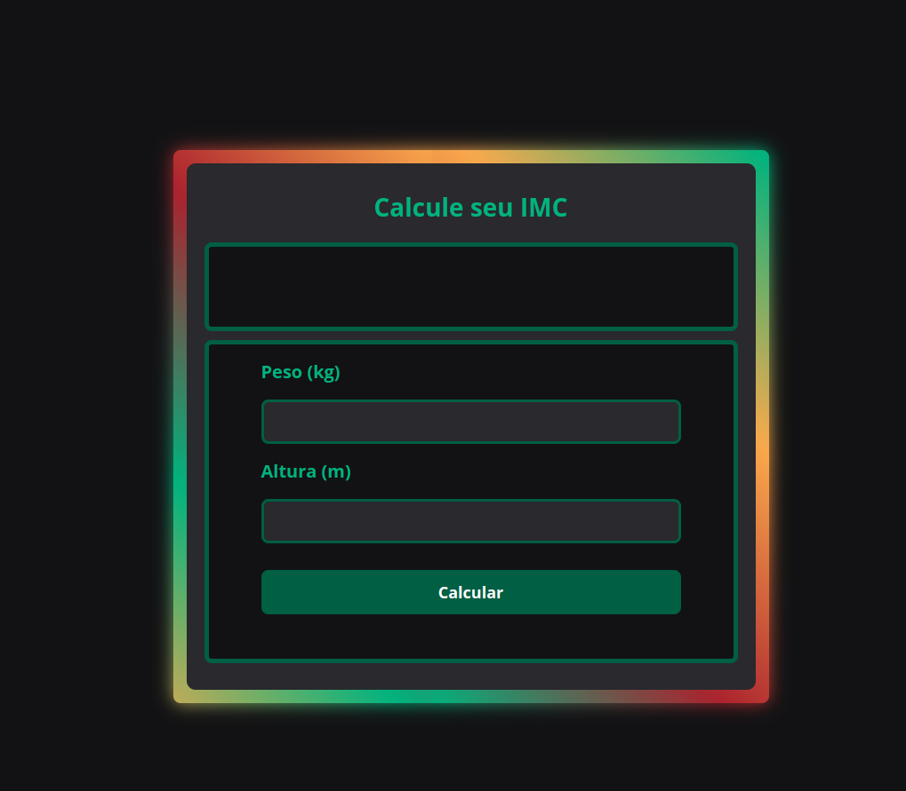

# Calculadora de IMC

Este projeto consiste em um formulário que calcula o Índice de Massa Corporal (IMC) do usuário com base em seu peso e altura. O resultado é exibido na página.

## Tecnologias utilizadas

- HTML
- CSS
- JavaScript

## Como executar o projeto

1. Baixe os arquivos do projeto em seu computador.
2. Abra o arquivo index.html em seu navegador.

## Como usar o formulário

1. Insira seu peso em quilogramas no campo "Peso".
2. Insira sua altura em metros no campo "Altura".
3. Clique no botão "Calcular".
4. O resultado será exibido abaixo do botão, indicando seu IMC e a categoria correspondente.

<h1 align="center">
  
</h1>
